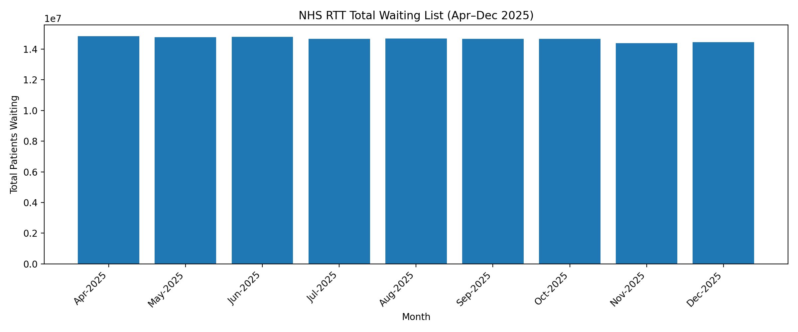
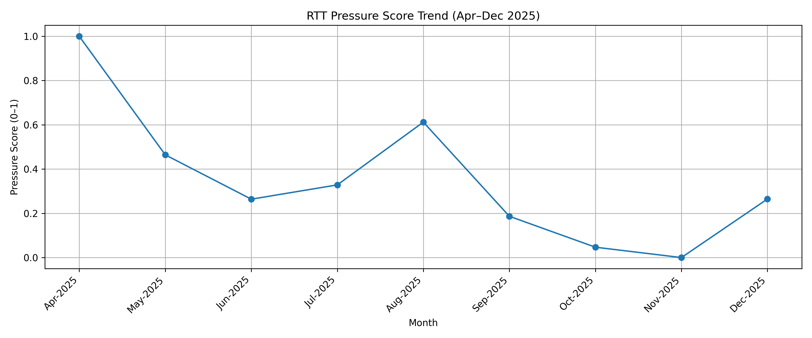
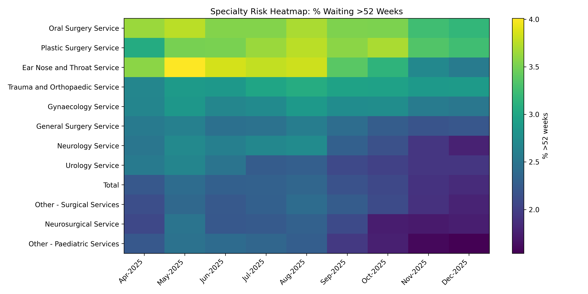

# NHS Referral to Treatment (RTT) Operational Pressure Analysis – 2025
This project develops an interpretable operational pressure model using NHS England Referral to Treatment (RTT) waiting list statistics.

Using monthly national data from April to December 2025, the analysis evaluates waiting list dynamics, breach patterns beyond the 18-week constitutional standard, and long-wait concentrations exceeding 52 weeks.

A composite pressure score is introduced to provide a structured indicator of system strain across time.

Rather than treating NHS statistics as descriptive reporting, the project demonstrates how national operational datasets can support decision-support frameworks for capacity prioritisation, backlog management, and escalation planning within public healthcare systems.
## Project Overview
This project analyses NHS England Referral to Treatment (RTT) incomplete pathway data from April 2025 to December 2025.

The objective is to transform publicly available national waiting list data into structured decision-support insights for operational pressure management.

Rather than focusing on descriptive statistics alone, this project develops an interpretable pressure model and escalation framework to support NHS operational strategy.

---

## Data Source

* NHS England RTT Incomplete Pathways Full Extracts  
* Monthly data: April 2025 – December 2025  
* Publicly available provider-level aggregated data  

All analysis is based exclusively on publicly published statistics.

---

## Key Metrics Analysed

* Total Waiting List Size  
* Percentage Waiting >18 Weeks  
* Percentage Waiting >52 Weeks  
* Month-on-Month Change  
* Composite Pressure Score (Normalised Indicator)  

---

## Key Findings (Apr–Dec 2025)

* National waiting list declined gradually from April to November 2025  
* >52 week waits reduced significantly toward late 2025  
* April 2025 represented peak operational pressure  
* November 2025 represented lowest pressure period in dataset  
* Certain surgical specialties show sustained long-wait concentration  

---

## Visual Evidence

### National Waiting List Trend

### Pressure Score Trend

### High-Risk Specialties (Heatmap)

---

## Decision-Support Framework

This project introduces:

* Pressure Score ranking model  
* Operational escalation tiers  
* Monitoring thresholds  
* Governance-aware automation boundaries  

The focus is structured decision support — not automated decision execution.
Based on the composite pressure score and breach thresholds, an operational escalation structure can be defined for RTT waiting list management.

Level 1 — Stability Monitoring  
Waiting list pressure remains within acceptable limits. Operational teams maintain routine monitoring and capacity planning while preserving buffer capacity.

Level 2 — Managed Pressure  
Where 18-week breaches increase or backlog growth accelerates, operational review is triggered. Actions may include targeted backlog clearance initiatives and pathway efficiency improvements.

Level 3 — Critical Pressure  
Where long-wait patients (>52 weeks) exceed acceptable thresholds, system-level intervention is required. Potential responses include temporary capacity redistribution, cross-provider collaboration, or focused backlog recovery programmes.

This framework illustrates how operational metrics can inform structured escalation decisions rather than passive monitoring.
---

## Repository Structure

/notebooks → Full analytical workflow  
/images → Generated charts and visual outputs  

---
Although based on NHS England RTT statistics, the analytical framework developed in this project is transferable to broader operational environments where demand, backlog, and capacity constraints must be managed simultaneously.

The pressure scoring approach demonstrates how aggregated operational data can support structured prioritisation and escalation planning across complex systems.

The methodology highlights the potential for decision-intelligence frameworks to complement traditional reporting dashboards by translating analytical signals into operational strategy.
## Governance & Analytical Boundaries

* No patient-level identifiable data used  
* No predictive modelling deployed  
* No live operational systems connected  
* Designed for decision-support context only  

The analysis prioritises interpretability, auditability, and responsible automation principles.
